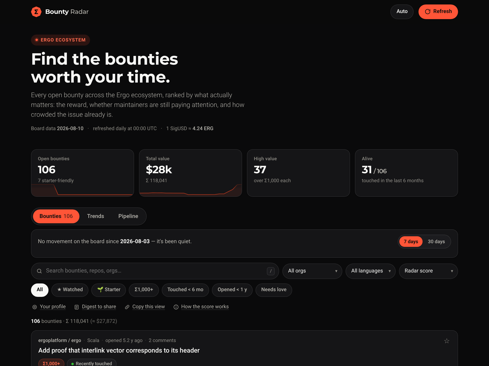
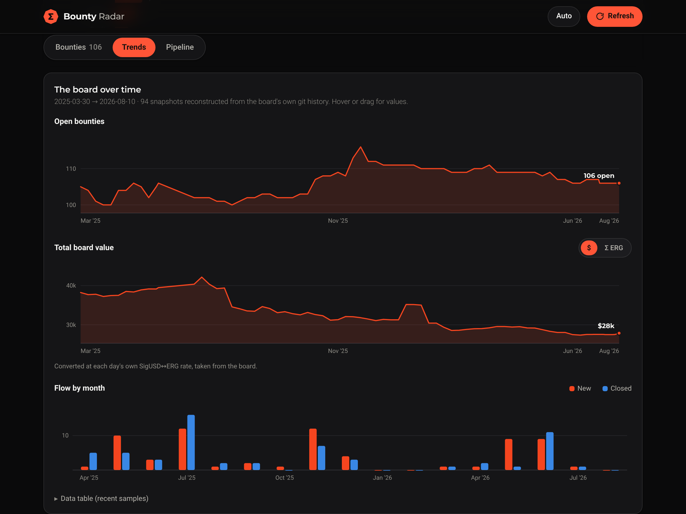

# 📡 Ergo Bounty Radar

**Find the bounties worth your time on the [Ergo ecosystem bounty board](https://github.com/ErgoDevs/Ergo-Bounties).**

The official board is a set of markdown tables regenerated daily — great as a source of truth, hard to explore. Bounty Radar turns it into a fast, filterable, single-page app with an opinionated ranking, a change log, and zero backend.



## Features

- **Radar score (0–100)** — a transparent heuristic that ranks every bounty by reward value (log-scaled), recent maintainer attention, competition (comments), and stack accessibility. Set **🎯 Your profile** (languages + experience) and the score re-weights for you.
- **What changed** — new, closed/paid, and re-priced bounties over the last 7 or 30 days, computed against archived snapshots. The official board has no history view; this fills that gap.
- **Trends** — open-bounty count, total board value (Σ or $, converted at each day's own rate), and monthly new-vs-closed flow since March 2025, rendered as dependency-free SVG from ~94 snapshots sampled out of the board's git history (weekly, then daily going forward).
- **📋 Digest** — one click generates a markdown summary (totals, changes, top opportunities) ready to paste into Discord, Telegram, or the forum.
- **Pipeline & payments** — who is working on what right now (submissions + open PRs from the board's triage dashboard, with 🔒 badges on reserved bounties), what has been paid (with on-chain transaction links), and how long submissions have been waiting for review.
- **★ Watchlist** — star bounties and filter to them; saved locally in your browser.
- **Shareable views** — active filters live in the URL hash, so any view is a link.
- **Reserve →** — opens the official pre-filled claim file on ErgoDevs/Ergo-Bounties, following the board's own [submission process](https://github.com/ErgoDevs/Ergo-Bounties/blob/main/docs/bounty-submission-guide.md).
- **↻ Refresh** — re-fetches and re-parses today's board client-side; the page never goes stale even between deployments.
- **Built to Ergo's brand** — official logo and orange (`#FF5537`), Montserrat + Roboto, in a three-tab app shell with light/dark themes, keyboard shortcuts (`/` to search), and chart colours validated for colour-vision deficiency and contrast in both modes. Mobile-first, no build step, no dependencies, one HTML file.



## How it works

```
index.html                     the whole app (data embedded between markers)
scripts/parser.js              parses the board's data/all.md into JSON
scripts/archive.js             daily job: fetch board → history/YYYY-MM-DD.json
                               → recompute 7/30-day baselines → refresh index.html
history/                       one JSON snapshot per day + index.json manifest
history/trends.json            the aggregate time series behind the Trends charts
scripts/backfill.js            one-off used to seed trends.json from upstream git history
.github/workflows/…            GitHub Action running archive.js every day at 01:30 UTC
```

The GitHub Action keeps the deployed page's embedded data fresh daily and accumulates history from day one — trend charts over the archived snapshots are the natural next feature.

## Deploy your own

1. Fork or push this repo.
2. **Settings → Actions → General → Workflow permissions** → *Read and write permissions*.
3. **Settings → Pages** → Deploy from a branch → `main` / root.
4. Optionally run the **Daily snapshot** workflow once by hand (Actions tab → Run workflow).

Done — the site lives at `https://<user>.github.io/<repo>/` and updates itself.

## Data & credits

All bounty data comes from [ErgoDevs/Ergo-Bounties](https://github.com/ErgoDevs/Ergo-Bounties), which indexes bounty-tagged issues across the Ergo ecosystem and regenerates daily at midnight UTC. Currency conversion uses the board's own oracle/DEX rates. The Radar score is a heuristic to aid discovery, not advice — always read the issue before reserving.

Unofficial community tool — not affiliated with the Ergo Foundation or ErgoDevs.

## License

[MIT](LICENSE)
